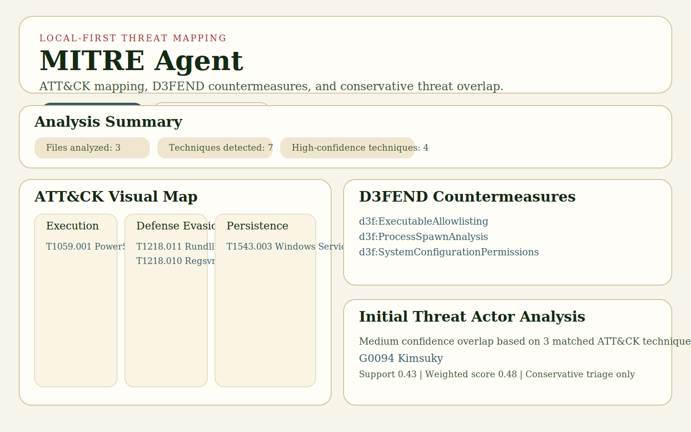
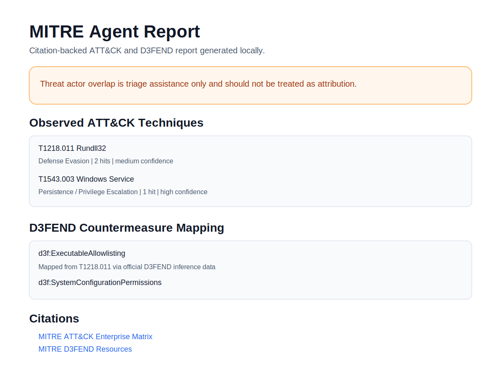

# MITRE Agent

MITRE Agent is a self-hosted, Docker-first analyst assistant for mapping local logs to MITRE ATT&CK techniques, projecting defensive countermeasures into MITRE D3FEND, and generating a local report with official MITRE citations.

It is designed for people who want ATT&CK-style investigation support without sending logs to a third-party service.





## What It Does

- Ingests local log files and extracts behavior evidence using ATT&CK-oriented heuristics.
- Produces an ATT&CK visual map and downloadable ATT&CK Navigator layer JSON.
- Maps observed ATT&CK techniques to D3FEND countermeasures using official MITRE D3FEND data.
- Generates a downloadable HTML report with citations back to official MITRE sources.
- Provides an initial, conservative threat-actor overlap view based on ATT&CK group technique relationships.

## Privacy Model

- Logs are processed locally by the running container.
- Cached ATT&CK and D3FEND reference data stays under `runtime/cache/`.
- Generated reports and analysis artifacts stay under `runtime/reports/`.
- Uploaded files stay under `runtime/uploads/`.
- No external database or cloud storage is required.

## Official Data Sources

MITRE Agent syncs and cites from MITRE-controlled sources:

- [MITRE ATT&CK Data & Tools](https://attack.mitre.org/resources/attack-data-and-tools/)
- [MITRE ATT&CK](https://attack.mitre.org/)
- [MITRE ATT&CK STIX Data Repository](https://github.com/mitre-attack/attack-stix-data)
- [MITRE D3FEND Resources](https://d3fend.mitre.org/resources)
- [MITRE D3FEND API Documentation](https://d3fend.mitre.org/api-docs)

## Quick Start

### 1. Start the stack

```bash
docker compose up --build
```

Open:

- App UI: [http://localhost:8000](http://localhost:8000)
- ATT&CK Navigator: [http://localhost:4200](http://localhost:4200)

### 2. Sync MITRE data

Use the `Sync MITRE Data` button in the UI before your first analysis run.

### 3. Analyze local logs

Upload one or more local log files. The app will generate:

- an ATT&CK-style matrix view,
- a downloadable ATT&CK Navigator layer JSON,
- a D3FEND countermeasure map,
- an HTML report with citations,
- a conservative threat-actor overlap view.

## Project Layout

```text
app/
  analyzer.py
  attack.py
  d3fend.py
  heuristics.py
  main.py
  reporting.py
  static/
docs/
  assets/
  RELEASE_CHECKLIST.md
runtime/
  cache/
  reports/
  uploads/
```

## Detection and Attribution Notes

- ATT&CK detections are heuristic and intended for triage support.
- Threat-actor results are intentionally conservative and suppress weak single-technique overlaps.
- MITRE Agent helps prioritize analyst review; it does not perform definitive attribution.

## Running Notes

- The main API and UI are served by the `mitre-agent` container.
- The ATT&CK Navigator UI is served by MITRE’s published Navigator container.
- Data is mounted from the local `runtime/` directory so users retain control over cache and outputs.

## Release Prep

See [docs/RELEASE_CHECKLIST.md](docs/RELEASE_CHECKLIST.md) before publishing a GitHub release or sharing the project more broadly.

## Roadmap

- Improve behavioral detection coverage for common Windows, Linux, and cloud log sources.
- Add analyst-tunable detection packs instead of hard-coded heuristics only.
- Add better suppression logic for benign administration patterns.
- Add packaged demo datasets and reproducible walkthroughs.
- Add CI, tests, and release automation for public distribution.
